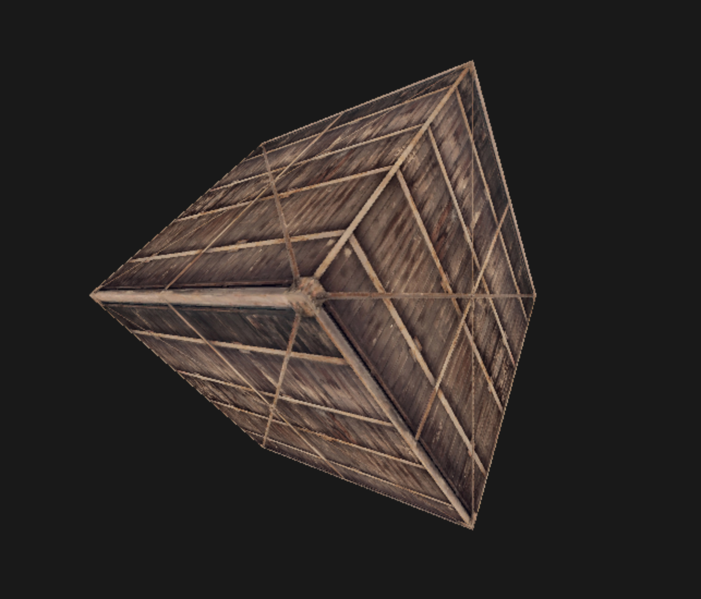

# SoftRenderer

一个基于SDL的软渲染器。单头文件，纯C++编写。

需要`SDL`和`SDL_image`进行编译。

参考了[韦易笑大神的RenderHelp项目](https://github.com/skywind3000/RenderHelp)。

制作的详细知识点可以参考[我的博客](https://visualgmq.gitee.io/2022/03/06/%E4%BB%8E0%E5%BC%80%E5%A7%8B%E5%88%B6%E4%BD%9C%E8%BD%AF%E6%B8%B2%E6%9F%93%E5%99%A8%EF%BC%88%E9%9B%B6%EF%BC%89/)

## 功能

- [x] 面剔除
- [x] 深度测试
- [x] 可编程着色器
- [x] 纹理映射

## 效果图

